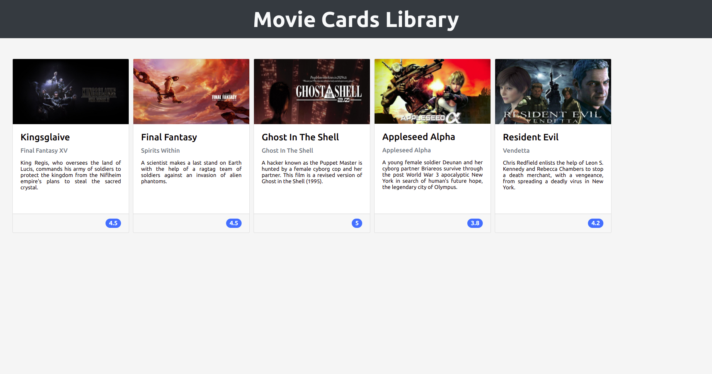

<h1 align="center">Project Movie Cards Library</h1>

## 💻 Instalando o projeto

Clone o repositório:

```
git clone git@github.com:lramos33/project-movie-cards-library.git
```

Instale as dependências:
```
npm install
```

Execute a aplicação
```
npm start
```

## 🚀 Habilidades

- Inicializar um projeto em React;
- Utilizar JSX no React;
- Utilizar o ReactDOM.render para renderizar elementos numa página web;
- Utilizar o import para usar código externo junto ao seu;
- Criar componentes React corretamente;
- Fazer uso de props corretamente;
- Fazer composição de componentes corretamente;
- Criar múltiplos componentes dinamicamente;
- Utilizar PropTypes para checar o tipo de uma prop no uso de um componente;
- Utilizar PropTypes para garantir a presença de props obrigatórias no uso de um componente;
- Utilizar PropTypes para checar que uma prop é um objeto de formato específico;
- Utilizar PropTypes para garantir que uma prop é um array com elementos de um determinado tipo.

## 🔧 O que foi desenvolvido

Foi desenvolvido uma biblioteca de cartões de filmes utilizando React. A biblioteca possui um cabeçalho e uma lista de cartões. Cada cartão representa um filme e possui uma imagem, título, subtítulo, sinopse e avaliação.



## Requisitos do projeto

- [x] 1 - Crie um componente `<Header />`
- [x] 2 - Renderize um texto no `<Header />`
- [x] Crie um componente `<MovieList />`
- [x] Renderize componentes `<MovieCard />` dentro de `<MovieList />`
- [x] Passe uma key para cada `<MovieCard />` renderizado
- [x] Crie um componente `<MovieCard />`
- [x] Renderize a imagem do filme dentro de uma tag `img`
- [x] Renderize o título do filme dentro de uma tag `h4`
- [x] Renderize o subtítulo do filme dentro de uma tag `h5`
- [x] Renderize a sinopse do filme dentro de uma tag `p`
- [x] Crie um componente `<Rating />`
- [x] Renderize a nota de um filme dentro de `<Rating />`
- [x] Renderize o componente `<Rating />` dentro de `<MovieCard />`
- [x] Passe como prop para o componente `<Rating />` o atributo rating
- [x] Crie um componente `<App />`
- [x] Renderize `<MovieList />` dentro do componente `<App />`
- [x] Adicione `PropTypes` a todos os componentes

##

<div align="center">
  
  
  
</div>
